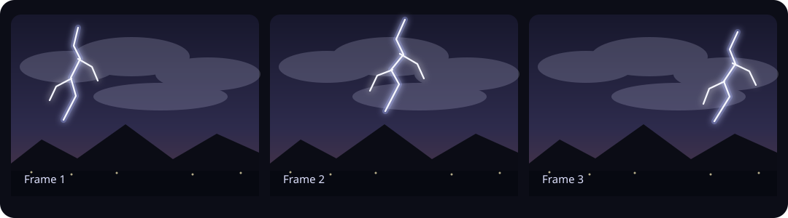
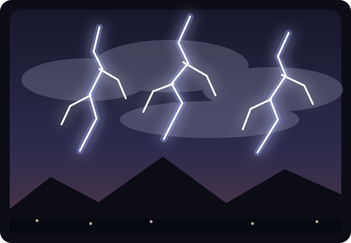

# Lightning Frame Stack

[](https://github.com/johncotter3/lightning-frame-stack/actions/workflows/ci.yml)
[](https://www.python.org/)
[](LICENSE)

Combine every lightning strike from a GIF or video into one clean still image.
The default pipeline stabilizes handheld footage, normalizes exposure, extracts
transient lightning detail, and avoids washing out the scene during full-cloud
flashes.

| Separate synthetic frames | Stacked result |
|---|---|
|  |  |

The source-controlled SVGs contain no private footage. Run
[`examples/create_synthetic_demo.py`](examples/create_synthetic_demo.py) to generate
an actual animated GIF, contact sheet, confidence mask, and stacked PNG using the
same processing pipeline.

## Why this is more than a maximum stack

A normal per-pixel maximum keeps the brightest value seen at every location.
That works for a fixed camera and steady exposure, but storm footage often has:

- handheld translation or rotation;
- broad cloud flashes that brighten most of the frame;
- changing automatic exposure;
- moving foreground details;
- narrow rolling-shutter or sensor-flare bars.

`lightning-stack` first aligns and exposure-matches each frame. In its default
`lightning` mode it then isolates thin, transient bright structure and composites
only the positive lightning contribution onto a selected base frame.

## Features

- GIF and common video input through Pillow and OpenCV.
- Automatic clean, sharp base-frame selection.
- Translation, Euclidean, or affine ECC stabilization.
- Robust global exposure matching.
- Lightning-detail extraction that suppresses broad cloud illumination.
- Long, straight artifact rejection for common phone-camera flare bars.
- Traditional exposure-normalized maximum-stack mode.
- Optional lightning confidence-mask output.
- Installable CLI plus a reusable Python API.

## Installation

Python 3.10 or newer is required.

```bash
git clone https://github.com/johncotter3/lightning-frame-stack.git
cd lightning-frame-stack
python -m venv .venv
source .venv/bin/activate  # Windows: .venv\\Scripts\\activate
python -m pip install --upgrade pip
python -m pip install .
```

For an editable development install:

```bash
python -m pip install -e ".[dev]"
```

## Quick start

Let the program choose a base frame automatically:

```bash
lightning-stack storm.mp4 -o all_strikes.png
```

Use a known clean frame as the background:

```bash
lightning-stack storm.mp4 -o all_strikes.png --base-frame 142
```

Process a GIF:

```bash
lightning-stack storm.gif -o all_strikes.png
```

The source checkout also retains the original script-style entry point:

```bash
python stack_lightning.py storm.mp4 -o all_strikes.png
```

## Common adjustments

Retain dimmer branches:

```bash
lightning-stack storm.mp4 -o stacked.png --threshold 3.5
```

Increase only the extracted lightning brightness:

```bash
lightning-stack storm.mp4 -o stacked.png --lightning-gain 1.25
```

Save a confidence mask for diagnosis:

```bash
lightning-stack storm.mp4 -o stacked.png --mask-output lightning_mask.png
```

Use an exposure-normalized maximum stack:

```bash
lightning-stack storm.mp4 -o max_stack.png --mode max
```

Disable alignment for locked-off footage:

```bash
lightning-stack storm.mp4 -o stacked.png --align none
```

Process only part of a long recording and sample every other frame:

```bash
lightning-stack storm.mp4 -o stacked.png --start 4.5 --end 12 --every 2
```

Run `lightning-stack --help` for every option.

## Tuning guide

| Symptom | Adjustment |
|---|---|
| Dim branches are missing | Lower `--threshold` or `--min-brightness` |
| Noise or cloud texture appears | Raise `--threshold` or `--min-difference` |
| Lightning looks too faint | Raise `--lightning-gain` |
| Handheld frames do not line up | Try `--align affine` and lower `--min-alignment-score` slightly |
| Moving clouds confuse alignment | Raise `--align-from` so more of the sky is ignored |
| Camera was perfectly fixed | Use `--align none` |
| A real long straight strike is removed | Use `--keep-straight-artifacts` |
| Full-cloud flashes still dominate | Keep default `lightning` mode rather than `max` |

## Python API

```python
from lightning_frame_stack import StackConfig, stack_media

result = stack_media(
    "storm.mp4",
    "all_strikes.png",
    config=StackConfig(
        base_frame=142,
        align="euclidean",
        threshold=4.0,
        lightning_gain=1.15,
    ),
    mask_output_path="lightning_mask.png",
    progress=print,
)

print(f"Processed {result.processed_frames} frames")
print(f"Used base frame {result.base_frame_index}")
```

## Processing pipeline

1. Inspect the animation or video and determine the requested frame range.
2. Select a relatively dark, low-lightning, sharp base frame unless one is given.
3. Estimate camera motion using the lower, usually stationary part of each frame.
4. Warp frames to the base coordinate system.
5. Match each frame's robust intensity quantiles to the base exposure.
6. Remove broad illumination with a Gaussian high-pass comparison.
7. Keep transient bright components that also became brighter than the base.
8. Reject suspiciously long, narrow, straight components by default.
9. Keep the strongest valid lightning contribution at every pixel.
10. Add that contribution to the untouched base image.

## Supported media

GIF decoding uses Pillow. Video decoding uses the codecs available to the local
OpenCV build. MP4, MOV, AVI, MKV, and WebM commonly work, but exact codec support
varies by operating system and installation.

## Limitations

- Large camera viewpoint changes or strong parallax cannot be fully corrected by
  a single affine transform.
- Lightning hidden behind moving objects cannot be reconstructed.
- Very broad, diffuse sheet lightning may be intentionally suppressed because it
  resembles exposure change rather than a thin transient structure.
- Aggressive automatic HDR, denoising, or frame interpolation can create false
  edges that require threshold tuning.

## Privacy

Processing is local. The tool does not upload footage. Before sharing examples or
bug reports, check for homes, license plates, faces, GPS metadata, or other
location-identifying details.

## Development

```bash
ruff check .
pytest --cov=lightning_frame_stack --cov-report=term-missing
python -m build
```

See [CONTRIBUTING.md](CONTRIBUTING.md) for the contribution workflow.

## License

MIT. See [LICENSE](LICENSE).
